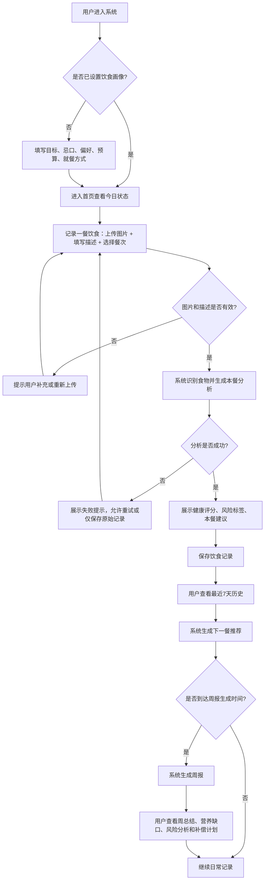
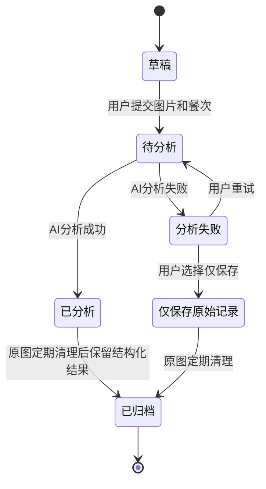
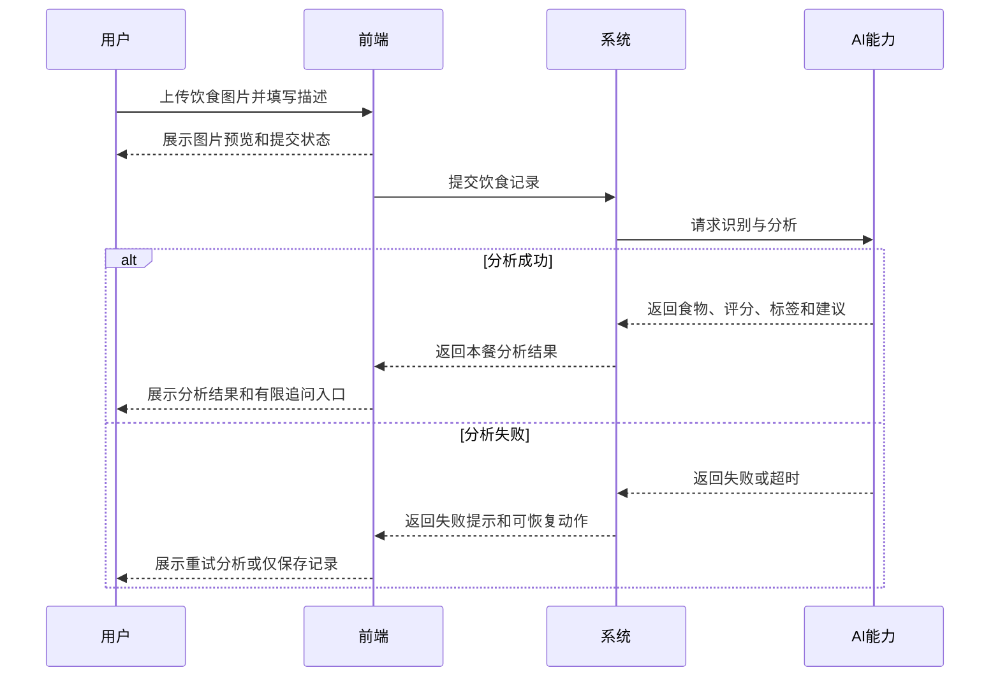

# 产品需求文档：健康饮食记录与推荐系统 - V1.0

## 1. 综述 (Overview)

### 1.1 项目背景与核心问题

本项目面向个人用户，目标是构建一个低成本、低维护的健康饮食记录与推荐系统。用户通过上传饮食照片和补充文字描述记录每日饮食，系统使用 AI 识别食物内容，生成本餐健康评价，并结合用户饮食画像和近期记录推荐下一餐方案。

第一版聚焦个人 MVP，不追求商业化、多用户社交、精确热量计算或复杂营养数据库。系统应优先保证核心链路可用、部署成本低、维护简单，并为后续升级为 Agent 项目保留扩展空间。

基础部署约束如下：

- 前端：Vue3 + Vite，部署到 Cloudflare Pages 免费版。
- 后端：FastAPI，部署到 Render Free Web Service。
- 数据库：Supabase Free Postgres。
- 图片存储：Supabase Storage。
- 定时任务：GitHub Actions。
- AI 能力：多模态大模型 API。

图片存储采用轻量策略：饮食照片可保存到 Supabase Storage，但必须前端压缩、限制 MVP 单餐 1 张，并定期清理原图。系统长期保留结构化饮食记录与 AI 分析结果，周报、趋势和推荐不依赖原始图片。

### 1.2 核心业务流程 / 用户旅程地图

1. **阶段一：初始化个人饮食画像** - 用户设置目标、忌口、偏好、预算和就餐方式，使后续分析与推荐具备个性化依据。
2. **阶段二：记录一餐饮食** - 用户上传饮食图片，补充文字描述，并选择餐次与就餐时间。
3. **阶段三：获得本餐分析** - 系统识别食物内容，生成健康评分、风险标签、本餐评价和调整建议。
4. **阶段四：查看历史与趋势** - 用户查看最近 7 天饮食记录，理解近期饮食结构和问题趋势。
5. **阶段五：获取下一餐推荐** - 系统结合画像、近期记录和用户临时条件，推荐下一餐可执行方案。
6. **阶段六：生成与查看周报** - 系统每周生成饮食总结、营养缺口、风险分析和下周补偿计划。

### 1.3 Mermaid 图（流程/状态/时序）

#### 1.3.1 用户操作流（必填）



#### 1.3.2 状态机（饮食记录）



#### 1.3.3 关键场景时序（图片记录与分析）



## 2. 用户故事详述 (User Stories)

### 阶段一：初始化个人饮食画像

---

#### **US-01: 作为个人用户，我希望设置饮食画像，以便系统后续分析和推荐更符合我的目标与偏好。**

* **价值陈述 (Value Statement)**:
  * **作为** 个人用户
  * **我希望** 设置健康目标、忌口、偏好、预算和就餐方式
  * **以便于** 系统在后续分析、推荐和周报中给出更符合实际情况的建议
* **业务规则与逻辑 (Business Logic)**:
  1. **前置条件**: 用户首次进入系统，或从“设置”页面主动编辑饮食画像。
  2. **操作流程 (Happy Path)**:
     1. 用户进入“个人饮食画像”页面。
     2. 用户选择健康目标，支持健康饮食、减脂、增肌、控糖等。
     3. 用户填写过敏食物、不喜欢的食物和偏好的食物。
     4. 用户选择单餐预算，枚举为低预算、中预算、高预算。
     5. 用户选择主要就餐方式，支持外卖、食堂、自己做饭等。
     6. 用户点击“保存”，系统保存画像，并在后续分析、推荐和周报中使用。
  3. **预算定义**:
     1. 低预算：单餐 ≤20 元。
     2. 中预算：单餐 21-50 元。
     3. 高预算：单餐 >50 元。
     4. 推荐结果不要求精确报价，但应避免明显超出预算层级的建议。
  4. **约束规则**:
     1. 过敏食物是强约束，推荐时不得主动推荐。
     2. 不喜欢的食物是弱约束，除非营养补偿必要，否则尽量避免。
     3. 偏好食物可作为推荐加分项，但不能牺牲健康目标。
  5. **异常处理 (Error Handling)**:
     1. 必填项缺失时，保存按钮不可用或提示补全。
     2. 用户可跳过部分非必填偏好，但系统应提示“推荐可能不够个性化”。
     3. 保存失败时，应保留用户已填写内容，并提示稍后重试。
* **验收标准 (Acceptance Criteria)**:
  * **场景1: 成功保存画像**
    * **GIVEN** 用户填写了健康目标、预算水平和就餐方式
    * **WHEN** 用户点击“保存”
    * **THEN** 系统应保存画像，并在首页或设置页展示已保存状态。
  * **场景2: 过敏食物参与推荐约束**
    * **GIVEN** 用户在画像中填写“花生”为过敏食物
    * **WHEN** 系统生成下一餐推荐
    * **THEN** 推荐内容不得包含花生或以花生为主要成分的食物。
  * **场景3: 跳过非必填信息**
    * **GIVEN** 用户只填写健康目标，未填写偏好食物
    * **WHEN** 用户点击“保存”
    * **THEN** 系统允许保存，并提示“推荐可能不够个性化”。
  * **场景4: 预算范围影响推荐**
    * **GIVEN** 用户选择单餐预算为“低：≤20元”
    * **WHEN** 系统生成下一餐推荐
    * **THEN** 推荐内容应优先给出低成本、易获得的饮食方案，并避免推荐明显高价食材或餐厅型方案。

---

* **页面布局线框图 (ASCII Wireframe)**:

```text
+------------------------------------------------+
| 个人饮食画像                                   |
+------------------------------------------------+
| 健康目标        [ 健康饮食 v ]                 |
|                                                |
| 过敏食物        [ 花生、海鲜...              ] |
| 不喜欢的食物    [ 香菜、肥肉...              ] |
| 偏好的食物      [ 鸡胸肉、米饭、青菜...      ] |
|                                                |
| 单餐预算        ( ) 低：≤20元                  |
|                 ( ) 中：21-50元                |
|                 ( ) 高：>50元                  |
| 就餐方式        [ 外卖 / 食堂 / 自己做饭 ]     |
|                                                |
| 提示：信息越完整，推荐越贴近你的实际情况。     |
|                                                |
| [ 稍后再说 ]                         [ 保存 ] |
+------------------------------------------------+
```

### 阶段二：记录一餐饮食

---

#### **US-02: 作为个人用户，我希望上传并提交一餐饮食记录，以便系统识别和保存我的实际饮食。**

* **价值陈述 (Value Statement)**:
  * **作为** 个人用户
  * **我希望** 上传饮食图片、补充描述并选择餐次
  * **以便于** 系统识别和保存我的实际饮食情况
* **业务规则与逻辑 (Business Logic)**:
  1. **前置条件**: 用户已进入“记录饮食”页面；用户可以已设置饮食画像，也可以暂未设置。
  2. **用户输入内容**:
     1. 饮食图片：MVP 单次只上传 1 张。
     2. 文字描述：可选，用于补充图片看不清的信息，例如“半碗米饭、少油、无糖饮料”。
     3. 餐次类型：早餐、午餐、晚餐、加餐。
     4. 就餐时间：默认当前时间，允许用户修改。
  3. **图片规则**:
     1. 支持 JPEG、PNG、WebP。
     2. 前端上传前压缩图片，建议最大宽度 1024px。
     3. 单张图片建议控制在 500KB-1MB。
     4. 图片保存到 Supabase Storage，数据库只保存图片地址和结构化分析结果。
     5. 原图默认定期清理，长期保留结构化记录与分析结果。
  4. **操作流程 (Happy Path)**:
     1. 用户选择图片，页面展示图片预览。
     2. 用户选择餐次和就餐时间，可填写补充描述。
     3. 用户点击“提交分析”。
     4. 系统上传图片、创建饮食记录，并进入分析等待状态。
  5. **异常处理 (Error Handling)**:
     1. 未上传图片时，不允许提交。
     2. 图片过大、格式不支持或上传失败时，应提示用户重新选择或压缩后重试。
     3. 图片上传失败时，保留用户已填写的餐次和描述。
     4. 文字描述为空时，允许提交。
     5. 用户重复点击提交时，应避免创建重复记录。
     6. AI 分析暂时失败时，可允许保存原始记录，稍后重试分析。
* **验收标准 (Acceptance Criteria)**:
  * **场景1: 成功提交饮食记录**
    * **GIVEN** 用户已上传一张合法图片，并选择餐次
    * **WHEN** 用户点击“提交分析”
    * **THEN** 系统应上传图片、创建饮食记录，并展示分析等待状态。
  * **场景2: 未上传图片**
    * **GIVEN** 用户未选择任何图片
    * **WHEN** 用户尝试点击“提交分析”
    * **THEN** 系统应阻止提交，并提示“请先上传饮食图片”。
  * **场景3: 图片格式不支持**
    * **GIVEN** 用户选择了非 JPEG、PNG、WebP 格式文件
    * **WHEN** 系统校验文件
    * **THEN** 系统应拒绝该文件，并提示“图片格式不支持，请上传 JPG、PNG 或 WebP”。
  * **场景4: 上传失败保留输入**
    * **GIVEN** 用户已填写餐次和补充描述
    * **WHEN** 图片上传失败
    * **THEN** 系统应提示上传失败，并保留用户已填写内容，允许重新提交。
  * **场景5: 重复提交保护**
    * **GIVEN** 用户已点击“提交分析”且请求处理中
    * **WHEN** 用户再次点击提交按钮
    * **THEN** 系统不应创建重复记录，并应保持按钮禁用或展示处理中状态。

---

* **页面布局线框图 (ASCII Wireframe)**:

```text
+------------------------------------------------+
| 记录饮食                                       |
+------------------------------------------------+
| 餐次            [ 早餐 v ]                     |
| 就餐时间        [ 2026-06-12 12:30        ]    |
|                                                |
| +------------------------------------------+   |
| |              上传饮食图片                |   |
| |           点击选择 / 拖拽到这里          |   |
| |           支持 JPG PNG WebP              |   |
| +------------------------------------------+   |
|                                                |
| 图片预览：                                    |
| +----------------------+                       |
| |      meal.jpg        |        [ 删除 ]      |
| +----------------------+                       |
|                                                |
| 补充描述                                      |
| [ 半碗米饭，鸡腿去皮，青菜较少...          ]   |
|                                                |
| [ 取消 ]                           [ 提交分析 ] |
+------------------------------------------------+
```

### 阶段三：获得本餐分析

---

#### **US-03: 作为个人用户，我希望查看本餐 AI 分析结果并进行有限追问，以便理解这顿饭的问题和调整方式。**

* **价值陈述 (Value Statement)**:
  * **作为** 个人用户
  * **我希望** 查看本餐分析，并围绕当前这顿饭进行有限追问
  * **以便于** 理解这顿饭的问题和下一步调整方式
* **业务规则与逻辑 (Business Logic)**:
  1. **前置条件**: 用户已成功提交一餐饮食记录；系统已完成或正在进行 AI 分析。
  2. **系统展示内容**:
     1. 识别出的食物列表。
     2. 本餐健康评分，范围 0-100。
     3. 风险标签，例如高油、高糖、蔬菜不足、蛋白质不足、主食过量等。
     4. 本餐评价摘要。
     5. 下一步建议，例如“晚餐增加绿叶菜和优质蛋白”。
  3. **有限追问范围**:
     1. 用户可以围绕当前这顿饭追问，例如“这顿饭最大的问题是什么？”、“晚餐怎么补回来？”。
     2. 不提供独立聊天页。
     3. 不支持开放式长期聊天。
     4. 不支持与当前饮食记录无关的话题。
     5. 不承诺医疗诊断或治疗建议。
     6. 默认不保存完整聊天记录，仅可将关键追问结论追加到本餐分析摘要或建议中。
  4. **异常处理 (Error Handling)**:
     1. AI 分析失败时，系统展示失败态，允许用户重试分析或仅保存原始记录。
     2. 追问失败时，不影响已生成的基础分析结果。
     3. 如果用户问题超出本餐范围，系统应提示“当前仅支持围绕本餐饮食进行追问”。
* **验收标准 (Acceptance Criteria)**:
  * **场景1: 成功展示分析结果**
    * **GIVEN** 用户已提交一餐记录且 AI 分析成功
    * **WHEN** 用户进入分析结果页
    * **THEN** 系统应展示食物列表、健康评分、风险标签、本餐评价和调整建议。
  * **场景2: AI 分析失败**
    * **GIVEN** 用户已提交一餐记录
    * **WHEN** AI 分析失败
    * **THEN** 系统应展示失败提示，并提供“重试分析”或“仅保存记录”的选择。
  * **场景3: 围绕本餐追问成功**
    * **GIVEN** 本餐已有分析结果
    * **WHEN** 用户输入“晚餐怎么补回来？”并发送
    * **THEN** 系统应基于当前餐食和用户画像返回一条调整建议。
  * **场景4: 追问超出范围**
    * **GIVEN** 用户在本餐追问框输入与饮食无关的问题
    * **WHEN** 用户点击发送
    * **THEN** 系统应提示“当前仅支持围绕本餐饮食进行追问”。
  * **场景5: 追问失败不影响基础分析**
    * **GIVEN** 本餐基础分析结果已生成
    * **WHEN** 用户发送追问但模型调用失败
    * **THEN** 系统应保留基础分析结果，并提示“追问暂时失败，请稍后重试”。

---

* **页面布局线框图 (ASCII Wireframe)**:

```text
+------------------------------------------------+
| 本餐分析结果                                   |
+------------------------------------------------+
| 餐次：午餐             时间：2026-06-12 12:30  |
|                                                |
| 图片预览                                       |
| +----------------------+                       |
| |      meal.jpg        |                       |
| +----------------------+                       |
|                                                |
| 健康评分：68 / 100                             |
| 标签：[ 高油 ] [ 蔬菜不足 ] [ 蛋白质适中 ]     |
|                                                |
| 识别食物                                       |
| - 米饭                                         |
| - 鸡腿                                         |
| - 青菜                                         |
|                                                |
| 本餐评价                                       |
| 这顿饭主食和油脂偏多，蔬菜略少。               |
|                                                |
| 调整建议                                       |
| 下一餐建议增加绿叶菜和豆制品，减少油炸食物。   |
|                                                |
| 围绕本餐追问                                   |
| [ 晚餐怎么补回来？                         ]   |
| [ 发送 ]                                       |
|                                                |
| 追问回复                                       |
| 建议晚餐选择清淡蛋白和大量蔬菜，主食减半。     |
+------------------------------------------------+
```

### 阶段四：查看历史与趋势

---

#### **US-04: 作为个人用户，我希望查看最近 7 天饮食历史，以便回顾自己的饮食结构和问题趋势。**

* **价值陈述 (Value Statement)**:
  * **作为** 个人用户
  * **我希望** 查看最近 7 天饮食历史和轻量趋势摘要
  * **以便于** 回顾自己的饮食结构和常见问题
* **业务规则与逻辑 (Business Logic)**:
  1. **前置条件**: 用户至少进入过系统；历史记录可以为空。
  2. **展示范围**:
     1. 默认展示最近 7 天饮食记录。
     2. 按日期倒序展示，每天内按餐次或时间排序。
     3. 每条记录展示餐次、时间、图片缩略图、识别食物、健康评分、风险标签。
     4. 用户可点击单条记录进入本餐分析结果页。
  3. **统计摘要**:
     1. 记录总餐数。
     2. 平均健康评分。
     3. 高频风险标签，例如蔬菜不足、高油、高糖。
     4. 早餐缺失次数，可根据早餐记录数量粗略判断。
  4. **异常处理 (Error Handling)**:
     1. 没有记录时，展示空态并引导用户记录第一餐。
     2. 某条记录 AI 分析失败时，仍展示原始图片、餐次和描述，并标记“待分析”或“分析失败”。
     3. 图片加载失败时，展示占位图，不影响文字信息查看。
     4. 历史页不重新调用 AI，只读取已保存结果。
* **验收标准 (Acceptance Criteria)**:
  * **场景1: 展示最近 7 天记录**
    * **GIVEN** 用户最近 7 天有多条饮食记录
    * **WHEN** 用户进入历史记录页
    * **THEN** 系统应按日期和时间展示记录，并显示每条记录的餐次、图片、食物、评分和标签。
  * **场景2: 点击进入分析详情**
    * **GIVEN** 历史列表中存在已分析记录
    * **WHEN** 用户点击“查看分析”
    * **THEN** 系统应进入该餐的分析结果页。
  * **场景3: 无记录空态**
    * **GIVEN** 用户最近 7 天没有饮食记录
    * **WHEN** 用户进入历史记录页
    * **THEN** 系统应展示空态，并提供“记录第一餐”入口。
  * **场景4: 分析失败记录仍可见**
    * **GIVEN** 某条饮食记录 AI 分析失败
    * **WHEN** 用户查看历史记录
    * **THEN** 系统仍应展示原始图片、餐次、时间和用户描述，并标记分析状态。
  * **场景5: 历史页不重复分析**
    * **GIVEN** 用户进入历史记录页
    * **WHEN** 页面加载历史数据
    * **THEN** 系统只读取已保存结果，不应重新触发 AI 分析。

---

* **页面布局线框图 (ASCII Wireframe)**:

```text
+------------------------------------------------+
| 最近 7 天饮食记录                              |
+------------------------------------------------+
| 摘要                                           |
| 记录餐数：12    平均评分：72                   |
| 高频问题：[ 蔬菜不足 ] [ 高油 ]                |
| 早餐缺失：2 次                                 |
+------------------------------------------------+
| 2026-06-12                                     |
| +------+ 午餐 12:30     评分 68   [高油]       |
| | 图   | 米饭、鸡腿、青菜                       |
| +------+ [ 查看分析 ]                          |
|                                                |
| +------+ 早餐 08:10     评分 75   [蛋白质不足] |
| | 图   | 面包、牛奶                             |
| +------+ [ 查看分析 ]                          |
+------------------------------------------------+
| 2026-06-11                                     |
| +------+ 晚餐 19:20     待分析                  |
| | 图   | 用户描述：牛肉面                       |
| +------+ [ 查看记录 ]                          |
+------------------------------------------------+
| [ 记录新一餐 ]                                 |
+------------------------------------------------+
```

### 阶段五：获取下一餐推荐

---

#### **US-05: 作为个人用户，我希望获取下一餐推荐，以便根据近期饮食问题做出更均衡的选择。**

* **价值陈述 (Value Statement)**:
  * **作为** 个人用户
  * **我希望** 获取下一餐推荐，并可输入现实可选条件重新生成
  * **以便于** 在真实预算、食堂、外卖或家庭食材限制下做出更均衡的选择
* **业务规则与逻辑 (Business Logic)**:
  1. **前置条件**: 用户至少有一条已保存饮食记录；若没有历史记录，也可以基于用户画像生成通用推荐。
  2. **推荐依据**:
     1. 用户饮食画像：健康目标、过敏食物、不喜欢食物、偏好食物、单餐预算、就餐方式。
     2. 最近 7 天饮食记录：评分、风险标签、餐次缺失、食物结构。
     3. 最近一餐分析：用于短期补偿，例如上一餐高油，则下一餐建议清淡。
     4. 用户输入的临时条件：例如食堂可选菜、家中现有食材、外卖预算等。
  3. **推荐内容**:
     1. 推荐餐次。
     2. 推荐组合。
     3. 推荐理由。
     4. 需要避免的内容。
     5. 预算适配说明。
  4. **约束优先级**:
     1. 过敏食物是强约束，不得推荐。
     2. 单餐预算是强约束，推荐应匹配金额范围。
     3. 健康目标是主约束，例如减脂、增肌、控糖。
     4. 不喜欢食物是弱约束，尽量避免。
     5. 偏好食物可作为推荐加分项，但不能牺牲健康目标。
  5. **带临时条件重新推荐**:
     1. 用户点击“换一个推荐”时，系统展示文本输入框或弹层。
     2. 用户可以输入当前可选条件，例如“食堂今天只有鸡腿饭、牛肉面、麻辣烫”。
     3. 系统应在不违反强约束的前提下，根据用户输入重新生成推荐。
     4. 用户输入的临时条件只影响本次推荐，默认不写入长期画像。
     5. 如果用户输入与强约束冲突，系统应拒绝推荐并解释原因。
     6. 如果用户输入选项都不理想，系统应从中选择相对更合适的方案，并说明“这是当前选项中较优选择”。
  6. **异常处理 (Error Handling)**:
     1. 无历史记录时，展示“基于画像的初始推荐”。
     2. 画像缺失时，展示通用健康饮食推荐，并提示完善画像。
     3. 模型调用失败时，展示兜底推荐。
     4. 推荐不提供医疗诊断，不替代医生或营养师建议。
* **验收标准 (Acceptance Criteria)**:
  * **场景1: 基于历史生成推荐**
    * **GIVEN** 用户最近 7 天有饮食记录，且多次出现“蔬菜不足”标签
    * **WHEN** 用户进入下一餐推荐页面
    * **THEN** 系统应推荐包含蔬菜补充的饮食方案，并说明推荐理由。
  * **场景2: 过敏食物强约束**
    * **GIVEN** 用户画像中填写“花生”为过敏食物
    * **WHEN** 系统生成下一餐推荐
    * **THEN** 推荐内容不得包含花生或花生成分明显的食物。
  * **场景3: 预算强约束**
    * **GIVEN** 用户选择单餐预算为“低：≤20元”
    * **WHEN** 系统生成下一餐推荐
    * **THEN** 推荐应优先给出低成本方案，并避免明显高价食材或餐厅型建议。
  * **场景4: 无历史记录**
    * **GIVEN** 用户没有任何饮食记录，但已填写饮食画像
    * **WHEN** 用户进入下一餐推荐页面
    * **THEN** 系统应展示基于画像的初始推荐，并提示记录更多饮食可提升准确性。
  * **场景5: 推荐生成失败**
    * **GIVEN** 用户请求下一餐推荐
    * **WHEN** 模型调用失败
    * **THEN** 系统应展示兜底健康推荐，并提示“智能推荐暂时不可用”。
  * **场景6: 根据临时条件重新推荐**
    * **GIVEN** 用户已有一条下一餐推荐
    * **WHEN** 用户点击“换一个推荐”，输入“食堂只有鸡腿饭、牛肉面、麻辣烫”，并点击“重新生成”
    * **THEN** 系统应在这些选项中选择相对更合适的饮食方案，并说明选择理由和需要注意的搭配。
  * **场景7: 临时条件与过敏约束冲突**
    * **GIVEN** 用户画像中过敏食物包含“花生”
    * **WHEN** 用户输入“我想吃花生酱拌面”并请求重新推荐
    * **THEN** 系统不得推荐该方案，并应提示该食物与过敏约束冲突。

---

* **页面布局线框图 (ASCII Wireframe)**:

```text
+------------------------------------------------+
| 下一餐推荐                                     |
+------------------------------------------------+
| 推荐餐次：晚餐                                 |
| 依据：最近 7 天蔬菜不足 5 次，上一餐偏油       |
+------------------------------------------------+
| 推荐组合                                       |
| - 杂粮饭半碗                                   |
| - 清蒸鱼 / 鸡胸肉                              |
| - 两份绿叶菜                                   |
| - 无糖饮品                                     |
|                                                |
| 推荐理由                                       |
| 这份搭配可以补充蛋白质和蔬菜，同时降低油脂摄入。 |
|                                                |
| 需要避免                                       |
| - 油炸食物                                     |
| - 奶茶或含糖饮料                               |
|                                                |
| 预算适配：中预算 21-50 元，可在食堂或普通外卖实现 |
|                                                |
| [ 换一个推荐 ]                      [ 记录这一餐 ] |
+------------------------------------------------+
| 换一个推荐                                     |
| 当前可选条件                                   |
| [ 食堂只有鸡腿饭、牛肉面、麻辣烫...        ]   |
|                                                |
| [ 取消 ]                            [ 重新生成 ] |
+------------------------------------------------+
```

### 阶段六：生成与查看周报

---

#### **US-06: 作为个人用户，我希望查看每周饮食报告，以便了解长期饮食问题、营养缺口和下周调整方向。**

* **价值陈述 (Value Statement)**:
  * **作为** 个人用户
  * **我希望** 查看每周饮食报告
  * **以便于** 理解长期饮食问题、可能营养缺口和下周调整方向
* **业务规则与逻辑 (Business Logic)**:
  1. **前置条件**: 用户最近 7 天内有饮食记录；若记录过少，也可以生成简化报告，但需提示参考价值有限。
  2. **生成方式**:
     1. 系统每周定时生成一次周报。
     2. 用户也可以手动触发生成或重新生成。
     3. 周报生成时优先读取结构化分析结果，不重新读取原始图片。
     4. 若照片已被定期清理，不影响周报生成。
     5. 同一周只保留一份最新周报，手动重新生成会覆盖本周报告内容。
  3. **周报内容**:
     1. 本周饮食总结。
     2. 记录完整度，例如“本周记录 13 餐，早餐缺失 3 次”。
     3. 平均健康评分。
     4. 高频风险标签，例如高油、蔬菜不足、高糖。
     5. 营养或饮食结构缺口，例如蛋白质不足、蔬菜摄入不足、水果少。
     6. 风险分析，例如长期高油、晚餐过量、早餐缺失。
     7. 下周补偿计划，例如“每天增加一份绿叶菜，早餐增加蛋白质来源”。
  4. **报告口径**:
     1. 周报只作为健康饮食建议，不作为医疗诊断。
     2. 当记录不足时，应明确提示“记录较少，结论仅供参考”。
     3. 周报应避免绝对化表达，应使用“可能”“倾向”“建议关注”等表述。
  5. **异常处理 (Error Handling)**:
     1. 最近 7 天无记录时，不生成周报，展示空态并引导记录饮食。
     2. 模型调用失败时，允许稍后重试。
     3. 定时任务失败时，不影响用户继续记录饮食。
     4. 原图已清理时，仍应基于结构化分析结果生成报告。
* **验收标准 (Acceptance Criteria)**:
  * **场景1: 成功查看周报**
    * **GIVEN** 用户最近 7 天有足够饮食记录
    * **WHEN** 用户进入周报页面
    * **THEN** 系统应展示本周总结、记录完整度、平均评分、高频问题、可能缺口、风险分析和下周补偿计划。
  * **场景2: 记录不足生成简化报告**
    * **GIVEN** 用户最近 7 天仅记录 1-2 餐
    * **WHEN** 用户生成周报
    * **THEN** 系统可生成简化报告，并提示“记录较少，结论仅供参考”。
  * **场景3: 无记录空态**
    * **GIVEN** 用户最近 7 天没有任何饮食记录
    * **WHEN** 用户进入周报页面
    * **THEN** 系统不生成周报，并展示记录饮食入口。
  * **场景4: 原图已清理仍可生成周报**
    * **GIVEN** 部分历史饮食照片已被定期清理
    * **WHEN** 系统生成周报
    * **THEN** 系统应基于结构化分析结果生成报告，不依赖原始图片。
  * **场景5: 重新生成覆盖本周报告**
    * **GIVEN** 本周已存在一份周报
    * **WHEN** 用户点击“重新生成”并确认
    * **THEN** 系统应重新生成本周报告，并用最新内容覆盖当前周报。
  * **场景6: 生成失败可重试**
    * **GIVEN** 用户请求生成周报
    * **WHEN** 模型调用失败
    * **THEN** 系统应提示“周报生成失败，请稍后重试”，不影响历史饮食记录查看。

---

* **页面布局线框图 (ASCII Wireframe)**:

```text
+------------------------------------------------+
| 每周饮食报告                                   |
+------------------------------------------------+
| 周期：2026-06-08 至 2026-06-14                 |
| 记录完整度：本周记录 13 餐，早餐缺失 3 次      |
| 平均评分：72 / 100                             |
+------------------------------------------------+
| 本周总结                                       |
| 本周整体饮食较稳定，但蔬菜摄入偏少，晚餐偏油。 |
|                                                |
| 高频问题                                       |
| [ 蔬菜不足 5 次 ] [ 高油 4 次 ] [ 早餐缺失 3 次 ] |
|                                                |
| 可能缺口                                       |
| - 绿叶菜摄入不足                               |
| - 早餐蛋白质不足                               |
| - 水果记录较少                                 |
|                                                |
| 风险分析                                       |
| 晚餐油脂偏高可能影响整体热量控制。             |
|                                                |
| 下周补偿计划                                   |
| 1. 每天至少增加一份绿叶菜                      |
| 2. 早餐增加鸡蛋、牛奶或豆制品                  |
| 3. 晚餐减少油炸和重口味外卖                    |
|                                                |
| [ 重新生成 ]                         [ 查看历史记录 ] |
+------------------------------------------------+
```

## 3. MVP 范围边界

### 3.1 第一版包含

- 设置个人饮食画像。
- 上传单餐饮食图片并补充描述。
- AI 识别食物并生成本餐分析。
- 围绕本餐分析进行有限追问。
- 查看最近 7 天饮食历史。
- 获取下一餐推荐，支持输入现实条件重新生成。
- 每周生成并查看饮食报告。
- 图片压缩上传、Supabase Storage 保存、定期清理原图。

### 3.2 第一版不包含

- 精确热量计算。
- 复杂营养数据库。
- 完整聊天功能或独立聊天页。
- 多人社交系统。
- 外卖平台 API 接入。
- 运动手环接入。
- 医生或营养师模块。
- 商业化付费系统。
- Kubernetes、自建对象存储、Redis/Celery 等重型基础设施。

## 4. 数据与存储策略

### 4.1 核心数据对象

- `user_profile`：保存用户健康目标、忌口、偏好、预算和就餐方式。
- `meal_record`：保存每餐图片地址、描述、识别结果、健康评分、风险标签和建议。
- `weekly_report`：保存每周总结、缺口、风险分析和补偿计划。

### 4.2 图片保存策略

1. 饮食图片保存到 Supabase Storage。
2. 前端上传前压缩，建议最大宽度 1024px，目标大小 500KB-1MB。
3. MVP 单餐只支持 1 张图片。
4. 数据库保存图片地址和结构化分析结果。
5. 历史趋势、推荐和周报只读取结构化结果，不重新读取原图。
6. 默认定期清理原图，清理后保留饮食记录、评分、标签、识别食物和 AI 建议。

## 5. 部署与成本约束

1. 前端部署到 Cloudflare Pages 免费版。
2. 后端部署到 Render Free Web Service。
3. Render 不作为持久化文件存储，不保存上传图片或数据库文件。
4. Supabase Free Postgres 保存结构化数据。
5. Supabase Storage 保存压缩后的饮食图片。
6. GitHub Actions 定时触发周报生成。
7. AI 调用只在上传分析、有限追问、下一餐推荐和周报生成时触发，历史查看不重新调用模型。

